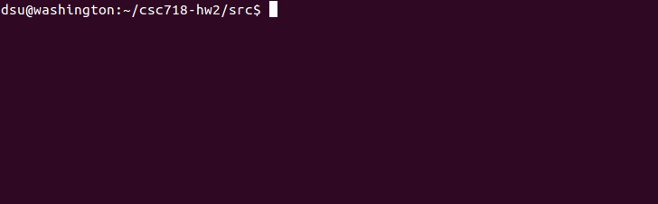
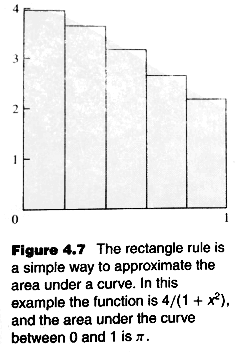
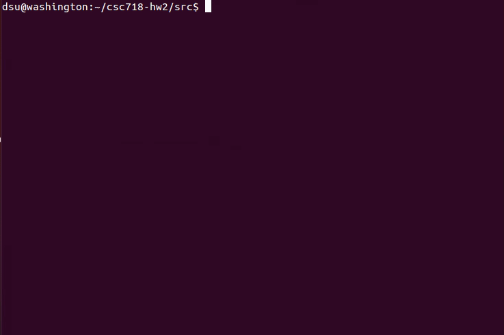

% Homework 2 OpenMPI Programming
% Jonathan Craton
% October 27, 2019

Programming Assignment 1
========================

> (20 points) A prime number is a positive integer evenly divisible by exactly two positive integers: itself and 1. The first five prime numbers are 2, 3, 5, 7, and 11. Sometimes two consecutive odd numbers are both prime. For example, the odd integers following 3, 5, 11 are all prime numbers. Write a sequential program to determine for all integers less than 1,000,000, the number of times that two consecutive odd integers are both prime numbers.

Compiling
---------

The source code for this can be found in `src/twin-primes-sequential.c`.

It can be compiled using `make twin-primes-sequential` in the src directory.

Running
-------

This can be run by calling `./twin-primes-sequential` in the src directory.

Running Time
------------

The program ran on average in ~0.65 seconds on one of the Rushmore systems.

Expected Output
---------------

This program should find 78498 primes up to 1,000,000. It should find 16,338 twin primes.

Programming Assignment 2
========================

> (30 points) A prime number is a positive integer evenly divisible by exactly two positive integers: itself and 1. The first five prime numbers are 2, 3, 5, 7, and 11. Sometimes two consecutive odd numbers are both prime. For example, the odd integers following 3, 5, 11 are all prime numbers. Write a parallel program using openMPI to determine for all integers less than 1,000,000, the number of times that two consecutive odd integers are both prime numbers.

Compiling
---------

The source code for this can be found in `src/twin-primes-mpi.c`.

It can be compiled using `make twin-primes-mpi` in the src directory.

Running
-------

This can be run by calling `make twin-primes-mpi-run` in the src directory.

If you'd like to run it on Rushmore, this can be done using `make twin-primes-mpi-rushmore`. This should build the program, copy the binaries to the correct systems, and then run it for np={1, 2, 3, and 4}.

Running Time
------------

The program ran on average in ~6 seconds on 4 of the Rushmore systems. Note that I've increase n significantly to extend running time.

  Problem           Np=1   Np=2   Np=3   Np=4
  ----------------- ------ ------ ------ ------
  Twin Primes       10.8   7.7    8.1    5.4      

Expected Output
---------------

This program should find 78498 primes up to 1,000,000. It should find 16,338 twin primes.

Algorithm
---------

Since an algorithms wasn't specified, I chose not to use Sieve of Eratosthenes and instead had each process simply determine the primality of a set of numbers.

Programming Assignment 3
========================

(30 points) The gap between consecutive prime numbers 2 and 3 is only 1, while the gap between consecutive primes 7 and 11 is 4. Write a parallel program using openMPI to determine, for all integers less than 1,000,000, the largest gap between a pair of consecutive prime numbers.

Compiling
---------

The source code for this can be found in `src/prime-gap.c`.

It can be compiled using `make prime-gap` in the src directory.

Running
-------

This can be run by calling `make prime-gap-run` in the src directory.

If you'd like to run it on Rushmore, this can be done using `make prime-gap-rushmore`. This should build the program, copy the binaries to the correct systems, and then run it for np={1, 2, 3, and 4}.

Running Time
------------

The program ran on average in ~6 seconds on 4 of the Rushmore systems. Note that I've increase n significantly to extend running time.

  Problem           Np=1   Np=2   Np=3   Np=4
  ----------------- ------ ------ ------ ------
  Prime Gap         10.7   7.7    8.0    5.4    

Expected Output
---------------

This program should find 788060 primes up to 12,000,000. It should find 138,022 twin primes.

Note that this program can be run using an n of 1,000,000 to return the same results as the sequential version.

Programming Assignment 4
========================

> (20 points) The value of the definite integral

$$\int_{0}^{1}\frac{4}{1 + x^{2}}\text{dx}$$

> is π . We can use numerical integration to compute π by approximating the area under the curve. A simple way to do this is called the rectangle rule (Figure 4.7). We divide the interval \[0, 1\] into *k* subintervals of equal size. We find the height of the curve at the midpoint of each of these subintervals. With these heights we can construct k rectangles. The area of the rectangles approximates the area under the curve. As *k* increases, the accuracy of the estimate also increases.

> A C program that uses the rectangle rule to approximate π appears in
Figure 4.8. Write a parallel MPI program to computer π using the
rectangle rule with 1,000,000 intervals. (Use the virtual cluster
provided in the class to develop and test the program.)

Compiling
---------

The source code for this can be found in `src/pi.c`.

It can be compiled using `make pi` in the src directory.

Running
-------

This can be run by calling `make pi-run` in the src directory.

If you'd like to run it on Rushmore, this can be done using `make pi-run-rushmore`. This should build the program, copy the binaries to the correct systems, and then run it for np={1, 2, 3, and 4}.

Running Time
------------

The program ran on average in ~6 seconds on 4 of the Rushmore systems. Note that I've increased n significantly to extend running time.

  Problem           Np=1   Np=2   Np=3   Np=4
  ----------------- ------ ------ ------ ------
  PI                6.5    3.2    2.9    2.2        

Expected Output
---------------

This program should produce the correct value for pi.

Running Times
=============

  Problem           Np=1   Np=2   Np=3   Np=4
  ----------------- ------ ------ ------ ------
  Twin Primes       10.8   7.7    8.1    5.4      
  Prime Gap         10.7   7.7    8.0    5.4    
  PI                6.5    3.2    2.9    2.2        

We generally see improvement as we add machines to our pool.

My pi implementation is close to the ideal, but my primes algorithm produces poor results. It requires 4 machines to see 2x performance, and for some reason 3 machines seem to perform worse than 2.

I believe that the core issue with my primes algorithm is the way that I assign primes to processes. One process has to check all of the largest numbers, which necessarily takes longer than a set of smaller numbers. It would be better to interleave the numbers to be checked so that the workload is spread more evenly.
